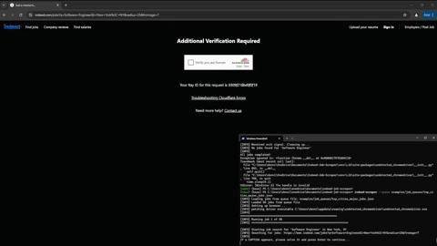
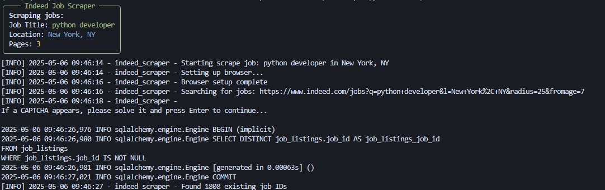

# Indeed Job Scraper [](https://www.repostatus.org/#active)



## Overview

A tool for scraping, storing, and analyzing job listings from Indeed.com. This project contains a command-line interface (CLI) for collecting job data, scripts to setup and store data in SQLite or SQL Server databases, and a Streamlit dashboard for visualizing and exploring job listings. Here's a demo [Streamlit dashboard](https://indeed-job-scraper-dashboard.streamlit.app/) featuring real scraped job data with SQLite backend.

## Features

- **Job Scraping**: Extract job listings from Indeed.com searches with customizable parameters
- **Search Filters**: Filter jobs by title, location, work setting, job type, and more
- **SQL Database Storage**: Store job data in SQLite or SQL Server databases
- **Dashboard Analytics**: Explore job data through charts and visualizations (Work in Progress)
- **Job Description Viewer**: View entire job descriptions and original links
- **CAPTCHA Handling**: Pauses for manual CAPTCHA completion before resuming

## Tech Stack

- **Python**
- **Selenium, chrome browser, undetected-chromedriver**: Web scraping with anti-detection
- **SQLAlchemy**: Database ORM
- **Pydantic**: Data validation and settings management
- **Typer & Rich**: Command-line interface, formatting
- **Streamlit**: Data visualization dashboard
- **Pandas & Plotly**: Data manipulation and visualization

## Installation

### Step 1: Clone the repository

```bash
git clone https://github.com/dennisvdang/Indeed-Job-Scraper.git
cd Indeed-Job-Scraper
```

### Step 2: Create and activate a virtual environment

#### Using venv (standard library)
```bash
# Windows
python -m venv venv
venv\Scripts\activate

# macOS/Linux
python -m venv venv
source venv/bin/activate
```

#### Using conda (alternative)
```bash
conda create -n indeed-scraper python=3.9
conda activate indeed-scraper
```

### Step 3: Install dependencies

```bash
pip install -e .
```

### Step 4: Set up the database

The default configuration uses SQLite, which requires no additional setup:

```bash
python setup_database.py --sqlite
```

For SQL Server (optional):

1. Create a `.env` file in the project root with your database connection details:

```
DB_SERVER=your_server_name
DB_NAME=your_database_name
DB_USERNAME=your_username
DB_PASSWORD=your_password
DB_USE_WINDOWS_AUTH=False
```

2. Run the database setup:

```bash
python setup_database.py
```

## Usage

### Command-Line Interface

```bash
# Single job search (results are saved to the database by default)
indeed-scraper scrape "python developer" --location "New York, NY"

# Skip database persistence
indeed-scraper scrape "python developer" --no-save

# With additional filters
indeed-scraper scrape "data scientist" \
  --location "Austin, TX" \
  --work-setting remote \
  --job-type full-time \
  --pages 5
```

```bash
# Batch job search from JSON config
indeed-scraper scrape jobs.json
```

#### CLI Options Reference

| Option                   | Type                  | Default | Description                                                                 |
|--------------------------|-----------------------|---------|-----------------------------------------------------------------------------|
| query                    | string                | N/A     | Job title or path to a JSON file with job configs                            |
| --location, -l           | string                | ""     | Location to search in                                                        |
| --radius, -r             | int                   | 25      | Search radius in miles                                                       |
| --pages, -p              | int                   | 3       | Maximum number of pages to scrape                                            |
| --days-ago, -d           | int                   | 7       | Jobs posted within days ago (valid options: 1, 3, 7, 14)                     |
| --work-setting, -w       | string                | None    | Work setting filter (remote, hybrid, onsite)                                   |
| --job-type, -j           | string                | None    | Job type filter (full-time, part-time, contract, etc.)                       |
| --headless               | flag                  | False   | Run browser in headless mode (not recommended due to CAPTCHA issues)          |
| --save/--no-save         | flag                  | True    | Persist scraped results to the database (use --no-save to skip persistence)   |
| --version, -v            | flag                  | False   | Show version and exit                                                         |
| --verbose, -V            | flag                  | False   | Enable verbose logging                                                        |
| --json-logs              | flag                  | False   | Output logs in JSON format                                                    |
| --log-file               | string                | None    | Log file path (default: stdout only)                                          |

### Streamlit Dashboard

```bash
streamlit run streamlit_app.py
```


## Project Structure

```
Indeed-Job-Scraper/
│
├── src/                       # Source code directory
│   ├── indeed_scraper/        # Main package
│   │   ├── __init__.py        # Package initialization
│   │   ├── cli.py             # Command-line interface
│   │   ├── scraper.py         # Web scraper functionality
│   │   ├── browser.py         # Browser setup and management 
│   │   ├── models.py          # Data models with Pydantic
│   │   ├── config.py          # Configuration management
│   │   ├── logger.py          # Structured logging utilities
│   │   ├── exporter.py        # Data export functionality
│   │   ├── descriptions.py    # Job description processing
│   │   ├── streamlit_dashboard.py # Dashboard implementation
│   │   ├── repository/        # Repository pattern implementation
│   │   │   ├── __init__.py    # Repository initialization
│   │   │   ├── base.py        # Repository interfaces
│   │   │   └── db_repository.py # Database repository implementation
│   │   └── database/          # Database-specific code
│   │
│   └── database/              # Core database functionality
│       ├── __init__.py        # Database package initialization
│       ├── connection.py      # Database connection management
│       ├── job_schema.py      # SQLAlchemy schema definitions
│       ├── repository.py      # Core repository implementation
│       ├── data_validator.py  # Data validation utilities
│       └── setup.py           # Database setup utilities
│
├── data/                      # Data storage directory
│   ├── exports/               # Exported data files
│   └── imports/               # Imported data files
│
├── tests/                     # Test directory
│
├── setup.py                   # Package installation
├── requirements.txt           # Project dependencies
├── setup_database.py          # Database initialization
├── streamlit_app.py           # Dashboard entry point
├── .env                       # Environment variables (not in repo)
└── .gitignore                 # Git ignore file
```

## Screenshots



## Future Improvements

- Additional job sources beyond Indeed
- Job responsibilities, benefits, experience level extraction using machine learning
- Salary prediction for listings without salary information
 
Contributions, suggestions, and feedback from everyone are warmly welcomed. Feel free to open an issue or submit a pull request if you'd like to help make the project better.

---
