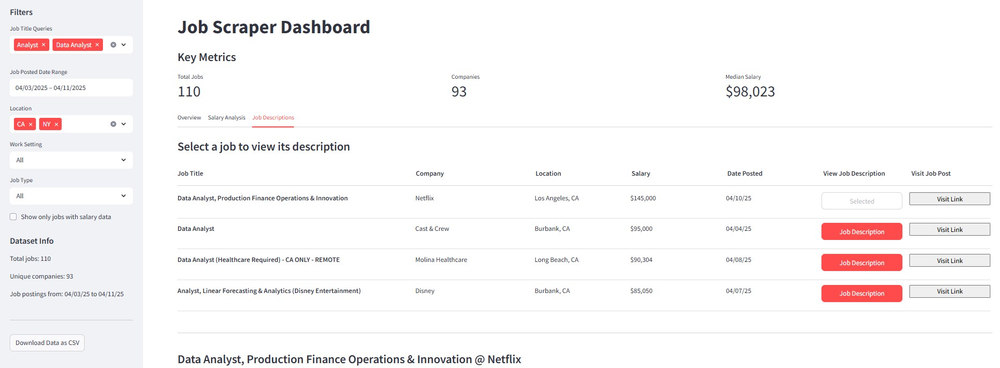

# Indeed Job Scraper [](https://www.repostatus.org/#wip)



A Python CLI tool for scraping job listings from Indeed.com and Streamlit dashboard for data visualization.

## 🚀 Overview

This tool scrapes job listings from Indeed.com and exports the data to CSV format. It extracts the following information:

- Job title and company name
- Location (city, state, zip) and salary information (when available)
- Job type (full-time, part-time, contract, etc.)
- Work setting (remote, hybrid, in-person)
- Full job descriptions and posting dates
- Advertisement status (identifies which job listings were originally ads)
- Standardized salary data (min, max, yearly equivalents)
- Job IDs and simplified, direct URLs for job listings
- Source URLs and search metadata

The scraper supports filtering by job title, location, posting date, work arrangement, and job type through command-line arguments.

## 🏁 Getting Started

### Installation

**Prerequisites:** Python 3.7+, pip

```bash
# Clone the repository
git clone https://github.com/dennisvdang/Indeed-Job-Scraper.git
cd Indeed-Job-Scraper

# Create virtual environment
python -m venv venv

# Activate virtual environment
venv\Scripts\activate  # On Windows
source venv/bin/activate  # On macOS/Linux

# Install required packages
pip install -r requirements.txt
```

This installs the `indeed-scraper` command globally in your virtual environment, allowing you to run it from anywhere.
```bash
pip install -e .
```

### Alternative Installation Methods

#### Using Conda

```bash
# Clone the repository
git clone https://github.com/dennisvdang/Indeed-Job-Scraper.git
cd Indeed-Job-Scraper

# Create and activate the conda environment
conda env create -f environment.yml
conda activate indeed-scraper

# Install the package
pip install -r requirements.txt
```

#### Using Docker

```bash
# Clone the repository
git clone https://github.com/dennisvdang/Indeed-Job-Scraper.git
cd Indeed-Job-Scraper

# Build the Docker image
docker build -t indeed-scraper .

# Run the container
docker run indeed-scraper conda run -n indeed-scraper indeed-scraper \
    --job-title "Data Scientist" \
    --location "New York" \
    --search-radius 25 \
    --num-pages 3 \
    --remote remote
```

## 📊 Usage

### Basic Command

```bash
indeed-scraper --job-title "Software Engineer" --location "San Francisco"
```

### All Available Options

| Parameter | Description | Possible Values | Default |
|-----------|-------------|-----------------|---------|
| `--job-title` | Job title to search for (required) | Any search string (e.g., "Data Analyst") | None (Required) |
| `--location` | Location to search in | Any city/state or zip code (e.g., "New York, NY" or "94105") | None |
| `--search-radius` | Search radius in miles from the location | Any positive integer | 25 |
| `--num-pages` | Maximum number of search result pages to scrape | Any positive integer | 3 |
| `--days-ago` | Filter for jobs posted within this many days | 1, 3, 7, 14 | 7 |
| `--work-setting` | Filter for specific work arrangements | "remote", "hybrid", "onsite" | None |
| `--job-type` | Filter for specific job types | "full-time", "part-time", "contract", "temporary", "temp-to-hire" | None |
| `--exclude-descriptions` | Skip scraping full job descriptions | Flag (no value required) | False |
| `--verbose` | Enable detailed logging | Flag (no value required) | False |
| `--output` | Custom output file path | Valid file path (e.g., "jobs.csv") | Auto-generated |
| `--keep-browser` | Keep browser open after scraping | Flag (no value required) | False |

### Example Commands

Basic search:
```bash
indeed-scraper --job-title "Data Analyst" --location "New York City"
```

Advanced search with all descriptions (default):
```bash
indeed-scraper \
    --job-title "Software Engineer" \
    --location "San Francisco" \
    --search-radius 50 \
    --num-pages 5 \
    --days-ago 14 \
    --work-setting remote \
    --job-type "full-time" \
    --verbose
```

### CAPTCHA Handling

Indeed employs CAPTCHA protection that requires human interaction:

1. When prompted (at program startup), solve the CAPTCHA in the browser window
2. Ensure the page loads completely after solving the CAPTCHA
3. Return to your terminal and press Enter to continue scraping

### Output Files

Results are saved in `data/raw/` with an auto-generated filename:
```
data/raw/indeed_[job_title]_[location]_[timestamp].csv
```

Example: `data/raw/indeed_software_engineer_san_francisco_20240404_103022.csv`

### Output Data Structure

The CSV output contains the following columns organized into logical groups:

**Identification:**
- `job_id` - Indeed's unique job identifier
- `source` - Always "Indeed" (useful if combining with other sources)

**Essential Information:**
- `title` - Job title
- `company` - Company name
- `queried_job_title` - The job title search query used to find this listing
- `work_setting` - Work arrangement (remote, hybrid, in-person)
- `job_type` - Job type (full-time, part-time, contract, etc.)

**Dates:**
- `date_posted` - Date the job was posted on Indeed (YYYY-MM-DD)
- `date_scraped` - Timestamp when the job was scraped (YYYY-MM-DD)

**Location:**
- `city` - City name extracted from location
- `state` - State code (e.g., CA, NY)
- `zip` - ZIP code if available

**Compensation:**
- `salary_period` - Pay period (hourly, weekly, monthly, yearly)
- `salary_min` - Minimum salary in original period
- `salary_max` - Maximum salary in original period
- `salary_min_yearly` - Minimum salary converted to yearly equivalent
- `salary_max_yearly` - Maximum salary converted to yearly equivalent
- `salary_midpoint_yearly` - Average of min and max yearly salaries

**URLs:**
- `job_url` - Direct link to the job posting
- `search_url` - URL used to perform the search

**Content:**
- `job_description` - Full job description text with formatting preserved

## 📊 Interactive Dashboard

The package includes an interactive Streamlit dashboard for visualizing the scraped job data and descriptions:

### Running the Dashboard

```bash
# Make sure you're in your virtual environment
# Launch the dashboard
streamlit run src/streamlit_dashboard.py
```

The dashboard will open automatically in your web browser, displaying all data from CSV files in the `data/raw/` directory.

## 🔧 Troubleshooting

### Common Issues

**ChromeDriver installation errors:**

- The tool currently requires Chrome version 134 (or compatible)
- Ensure you have Chrome installed and updated to a recent version
- If you encounter driver-related errors, try updating your Chrome browser
- The tool uses undetected-chromedriver which automatically handles most driver compatibility

**Scraping interruptions:**

- Indeed may rate-limit or block excessive requests; use reasonable values for `--num-pages`
- Try adding delays between runs if you perform multiple searches

## 🔮 Future Development

### Job Description Analysis

A planned enhancement is to implement an LLM pipeline in Python to extract the following topics from the scraped job descriptions:

| Topic | Examples |
|----------|----------|
| Domain/Industry | *Finance, Healthcare, Ecommerce* |
| Compensation | *Base salary, 401K, bonuses, equity* |
| Benefits | *PTO, healthcare, remote work options* |
| Requirements | *Education level, years of experience* |
| Role responsibilities* | *Project management, client relations, data analysis* |
| Technical requirements* | *Programming languages, certifications, tools*|
| Technologies mentioned* | *Salesforce, Python, AWS, WorkDay* |

*\* These topics might be included as they are interesting from a job seeker's perspective, but are lower priority.*

## ⚠️ Disclaimer

This tool is a proof-of-concept for educational and personal use only. Use responsibly and respect Indeed.com's terms of service by:

- Adding reasonable delays between requests
- Not performing excessive scraping
- Using for personal research purposes only